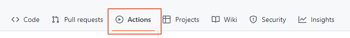
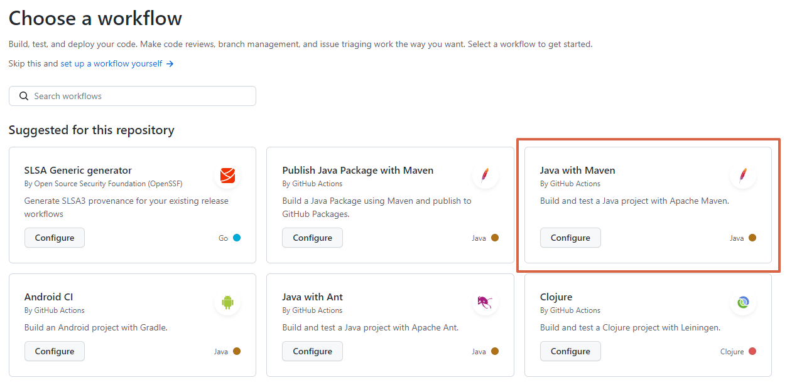
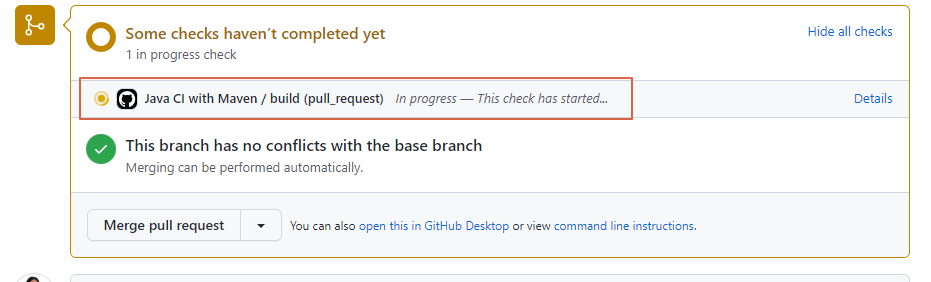
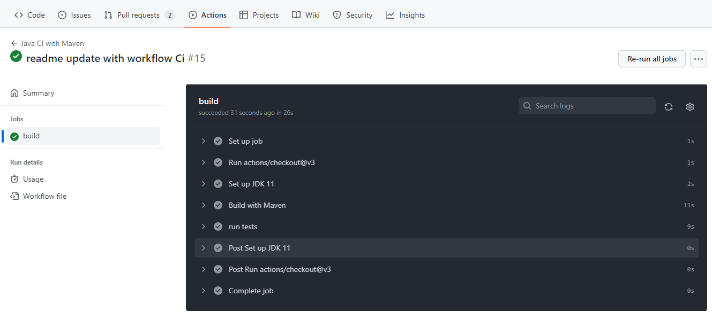

# Rest Assured Workshop

¡Bienvenido!

El objetivo de este taller es aprender sobre llamados rest con [RestAssured](https://rest-assured.io/). Durante el taller exploraremos la configuración de un proyecto desde cero (creará un repositorio con su cuenta), prepararlo para un proceso de integración continua por medio de Github actions y se abarcarán varios ejercicios prácticos, incluyendo temas como llamados HTTP, códigos de respuesta, reportes y mucho más.

Para el desarrollo del taller usaremos [GitHub](https://github.com/) y [GitHub Flow](https://docs.github.com/en/get-started/quickstart/github-flow) para realizar la entrega de cada ejercicio práctico.

Se asume que la persona tiene conocimientos previos en:

* Git (Puede seguir este [enlace](https://services.github.com/on-demand/downloads/es_ES/github-git-cheat-sheet/) con los comandos más utilizados en git)
* GitHub
* Conocimiento básico en JAVA (Clases, Objetos, POM)

#### Tips de GitHub Flow:

1. Para cada ejercicio crear una rama (Investiga: _gitflow naming conventions_ )
1. Crea un Pull Request (PR) por cada punto (Recuerda las interacciones como comentarios en inglés)
1. Después de que se recibe aprobación de cada punto por parte de los colaboradores (punto 1.17) se debe hacer merge de la rama, utilizando squash and merge.
1. Antes de empezar un nuevo punto se debe hacer pull de main para asegurarnos que tenemos los últimos cambios del anterior punto.

### Tabla de Contenido

1. [Configuración Inicial del Proyecto](#1-configuración-inicial-del-proyecto)
1. [Llamados a métodos HTTP](#2-llamados-a-métodos-http)
1. [Autenticación en RestAssured](#3-Autenticación-en-RestAssured)
1. [Aserciones con Hamcrest](#4-Aserciones-con-Hamcrest)
1. [Configuremos nuestro reporte con Allure](#5-Configuremos-nuestro-reporte-con-Allure)
1. [Ejercicio final usando una API real](#6-Ejercicio-final-usando-una-API-real)
1. [Configurar Integración Continua (CI)](#7-Configurar-Integración-Continua-(CI))

### 1. Configuración Inicial del Proyecto

**Descripción**: Se configurará inicialmente el proyecto con [Java](https://www.oracle.com/co/java/technologies/javase/javase8u211-later-archive-downloads.html) en el IDE [eclipse](https://www.eclipse.org/downloads/). Adicionalmente se creará la configuración necesaria básica para un repositorio de [Github](https://help.github.com/)

**Nota:** Si no tiene conocimiento sobre Github se le recomienda realizar las [Guias de Github](https://guides.github.com/activities/hello-world/) o el lab de [Introduction to Github](https://lab.github.com/githubtraining/introduction-to-github)

1. [Instalar JDK 8](https://www.oracle.com/co/java/technologies/javase/javase8u211-later-archive-downloads.html) en su equipo si no lo tiene instalado
1. [Instalar Eclipse](https://www.eclipse.org/downloads/) en su equipo si no lo tiene instalado (Eclipse IDE for Java Developers).
1. Configurar la variable de ambiente [JAVA_HOME](https://www.codejava.net/java-core/how-to-set-java-home-environment-variable-on-windows-10)
1. Instalar plugin de TestNG
    * Click en la pestaña de Help
    * Eclipse Marketplace
    * En la barra de búsqueda poner TestNG
    * Instalar la primera, TestNG for Eclipse. De click en Confirm y Finish
    * Marque todas las casillas y click en Trust Selected
    * Le pedirá que reinicie eclipse, acepte
1. Iniciar eclipse y crear un nuevo proyecto maven:
    * Archivo (File)
    * Nuevo (New)
    * Otro.. (Other..)
    * En el cuadro de búsqueda poner Maven y seleccionar **Maven Project**
    * Usar ubicación por defecto o seleccionar una. Siguiente
    * Buscar **maven-archetype-quickstart** del group id apache. Seleccionar y siguiente
    * En Group Id poner: com.restassured
    * En Artifact Id: workshop
    * Click en Finish
    * En la parte izquierda se generó el proyecto con nombre workshop. Se puede cambiar
1. Cambiar la librería para que ejecute con Java 8
    * Abrír el archivo **pom.xml** y cambiar donde esta `maven.compiler.source` y `maven.compiler.target` de `1.7` a `1.8`. Guardar y cerrar
    * Click derecho al proyecto > Maven > Update Project
    * Si al lado derecho de JRE System Library aparece JavaSE-1.8 todo esta funcionando correctamente

1. Crear una cuenta en Github si no la tiene.
1. Crear un repositorio en limpio dentro de la página de GitHub con el nombre de **rest-assured-workshop**
1. En el equipo, abrir la carpeta donde se creó el proyecto de Maven en eclipse y abrir una consola en esa ruta
1. Crear archivo .gitignore ```echo "" >> .gitignore```
1. Copiar, pegar y guardar el siguiente contenido. Esto evitará que se suban archivos al repositorio con estas extensiones:

    ```
    # Compiled class file
    *.class

    # Log file
    *.log

    # Package Files #
    *.jar
    *.war
    *.zip
    *.tar.gz
    *.rar

    # Auto-generated

    test-output/
    target/
    .idea/
    .vscode/

    pom.xml.tag
    pom.xml.releaseBackup
    pom.xml.versionsBackup
    pom.xml.next
    #Local Allure files
    .allure/
    allure-results/*.json
    ```

1. Seguir las instrucciones para realizar el primer commit

    ``` shell
    echo "# rest-assured-workshop" >> README.md
    git init
    git add .
    git commit -m "first commit"
    git branch -M main
    git remote add origin git@github.com:<su-usuario>/rest-assured-workshop.git
    git push -u origin main
    ```

1. Agregar dependencias de RestAssured y TestNG en el pom.xml

    * [RestAssured](https://mvnrepository.com/artifact/io.rest-assured/rest-assured) 
    * [TestNG](https://mvnrepository.com/artifact/org.testng/testng)
    * [Json-simple](https://mvnrepository.com/artifact/com.googlecode.json-simple/json-simple)

    Las dependencias deberían quedar similiar a:
    ```xml
    <dependency>
        <groupId>io.rest-assured</groupId>
        <artifactId>rest-assured</artifactId>
        <version>5.2.0</version>
        <scope>test</scope>
    </dependency>

    <dependency>
        <groupId>org.testng</groupId>
        <artifactId>testng</artifactId>
        <!--latest testng supported on java 8-->
        <version>7.5</version>
        <scope>test</scope>
    </dependency>

    <dependency>
        <groupId>com.googlecode.json-simple</groupId>
        <artifactId>json-simple</artifactId>
        <version>1.1.1</version>
    </dependency>
    ```

1. Crear carpeta de pruebas (de ahora en adelante `test`)
    * En la ruta `src/test/java/com/restassured` crear carpeta con de nombre `test`

1. Configurar Git para revision del workshop para cada punto

1. Proteger la rama `main` para que los pull request requieran revisión de otros desarrolladores y se compruebe el estado de nuestros test ("ok" :heavy_check_mark: o "fallaron" :x:) antes de hacer un merge a la rama.

    Ir a Settings > Branches adicionamos una regla dando click en **add rule**. Escribimos `main` en el campo de **branch name pattern**. Una vez hecho eso, damos click en las siguientes opciones:
    

1. Añadir como colaboradores (ir a settings del repositorio y en Collaborators) a:
   * [dianakrog](https://github.com/dianakrog)
   * [diegomtylop](https://github.com/diegomtylop)
   * [kliver98](https://github.com/kliver98)
   * [Scot3004](https://github.com/Scot3004)

### 2. Llamados a métodos HTTP

#### Creando peticiones GET y POST 
1. Crear la clase `GetAndPostExample.java` en la carpeta de `test`
    En caso que el archivo este vacío, copie y pegue:
    ```java
    package com.restassured.test;

    public class GetAndPostExample {
    }
    ```
1. Ahora vamos a crear nuestra prueba enviando una petición GET

    Copie y pegue:
    ```java
    @Test
    public void testGet() {
		RestAssured.baseURI = "https://reqres.in/api";
		
		when().
			get("/users?page=2").
		then().
			statusCode(200).
			body("data.size()", is(6)).
			body("data.first_name", hasItems("George", "Rachel"));
	};
    ```
    Primero definimos la baseURI que especifica la url base donde esta el servicio que consumiremos. Seguidamente preparamos el request, pero en este caso no tenemos ninguna precondición (given) entonces podemos ir a la acción (when) que define un método al API de tipo GET (get) para el endpoint que retorna los usuarios.
    Finalmente (then) validamos el status code de respuesta y datos del body de respuesta, como que contenga 6 elementos y especificamente contenga George y Rachel.

1. Vamos a crear la petición para el POST

    Copie y pegue:
    ```java
    @Test
	public void testPost() {
		
		JSONObject request = new JSONObject();
		
		request.put("name", "Ernesto Perez");
		request.put("job", "QA Automation");

		RestAssured.baseURI =  "https://reqres.in/api";
		
		given().
			header("Content-Type", "application/json").
			contentType(ContentType.JSON).
			body(request.toJSONString()).
		when().
			post("/users").
		then().
			statusCode(201).
			log().all();
	}
    ```
    Primero preparamos la request que enviaremos como un JSON, para esto usamos la clase JSONObject y después imprimimos como se vería ese JSON que creamos.
    Luego especificamos la url base (baseURI) a la cual le enviaremos el request.
    Finalmente en formato gherkin preparamos, enviamos y validamos el request. Aquí ponemos los header necesarios y el body a enviar, luego la acción que sería la url base y adicionamos el resto del endpoint para el método post, con el then verificamos el status code de la petición e imprimimos lo que nos retornó el endpoint.
    La parte importante aquí es la acción (when) para especificar el método HTTP.

    __Nota:__ Si quisieramos imprimir (por debuguear rápidamente por ejemplo) como esta el request formado, podemos usar `System.out.println(request.toJSONString());`

##### Ejercicio opcional:

 Usando usando esta API de Pokémon ([pokeapi.co]( https://pokeapi.co)), consumir el endpoint GET para obtener la información de un pokémon
 e imprimir el JSON de respuesta en la consola

#### Creando peticiones PUT, PATCH and DELETE
1. Crear la clase `PutPatchDeleteExample.java` en la carpeta de `test`. En caso que el archivo este vacío, copie y pegue:
    ```java
    package com.restassured.test;

    public class PutPatchDeleteExample {
    }
    ```
1. Ahora vamos a crear nuestras pruebas enviando una petición PUT y otra de PATCH

    Copie y pegue las siguientes porciones de código:
    ```java
    @Test
	public void testPut() {
		
		JSONObject request = new JSONObject();
		
		request.put("name", "Ernesto Perez");
		request.put("job", "QA Automation");
		
		RestAssured.baseURI =  "https://reqres.in/api";
		
		given().
			header("Content-Type", "application/json").
			contentType(ContentType.JSON).
			body(request.toJSONString()).
		when().
			put("/users/2").
		then().
			statusCode(200).
			log().all();
				
	}
    ```
    ```java
    @Test
	public void testPatch() {
		
		JSONObject request = new JSONObject();
		
		request.put("name", "Ernesto Perez");
		request.put("job", "QA Automation");
		
		RestAssured.baseURI =  "https://reqres.in";
		
		given().
			header("Content-Type", "application/json").
			contentType(ContentType.JSON).
			body(request.toJSONString()).
		when().
			patch("/api/users/2").
		then().
			statusCode(200).
			log().all();
				
	}
    ```
    Primero preparamos la request que enviaremos como un JSON, para esto usamos la clase JSONObject y después imprimimos como se veria ese json que creamos.
    Luego especificamos la url base (baseURI) a la cual le enviaremos el request.
    Finalmente en formato gherkin preparamos, enviamos y validamos el request. Aquí ponemos los header necesarios y el body a enviar, luego la acción que se sería la url base y adicionamos el resto del endpoint para el método (put o patch), con el then verificamos el status code de la petición e imprimimos lo que nos retorno el endpoint.
    La parte importante aquí es la acción (when) para especificar el método HTTP.
1. Vamos a crear la petición para el DELETE

    Copie y pegue:
    ```java
    @Test
	public void testDelete() {
		
		RestAssured.baseURI =  "https://reqres.in";
		
		when().
			delete("/api/users/2").
		then().
			statusCode(204).
			log().all();
				
	}
    ```
    En este caso no es necesario definir precondiciones o preparar lo que enviaremos (Given), debido a que el método DELETE de este endpoint solo se le especifica en la url (eliminar el usuario con id 2). Finalmente validamos el status code e imprimimos la respuesta de la petición.


### 3. Autenticación en RestAssured

Muchos servicios requieren de autenticación para consumir sus métodos, en este ejercicio vamos a construir un ejemplo de autenticación básica (Basic Auth).

Para esto utilizaremos el recurso [basic-auth de postman]( https://postman-echo.com/basic-auth). El endpoint acepta un nombre de usuario y una contraseña predeterminados y devuelve un código de estado de 200 ok, solo si se proporciona el mismo correctamente. De lo contrario, devolverá un código de estado 401 no autorizado.

La información de autenticacion del servicio es:

**Username**: _postman_

**Password**: _password_

Empecemos

1. Cree una clase Java llamada `BaseClassAuth.java` en el paquete `com.restassured.test` y cree una petición para autenticación con el siguiente código, la cual contiene los parámetros de la petición y autenticación:

	Copie y pegue:
    ```java
	package com.restassured.test;
	import org.testng.annotations.BeforeClass;
	import io.restassured.RestAssured;
	
	public class BaseClassAuth {
		
		@BeforeClass
		public void setup() {
			
			RestAssured.authentication = RestAssured.preemptive().basic("postman", "password");
			
			RestAssured.baseURI = "https://postman-echo.com/basic-auth";
			
		}
	
	}
    ```

1. Ahora cree una clase Java llamada `RestAssuredAuthTest.java` en el paquete `com.restassured.test` que extienda de la clase `BaseClassAuth.java` y que hace la petición para la autenticación.

	Copie y pegue:
    ```java
    package com.restassured.test;

	import org.testng.annotations.Test;
	
	import io.restassured.RestAssured;
	
	public class RestAssureAuth extends BaseClassAuth{
		
		@Test
		public void test1() {
			
			int code = RestAssured.given().
					get().
					getStatusCode();
			
			System.out.println("Response code form server is " + code);
			
		}
	
	}
    ```
    
 1. Ahora verifiquemos que el método de autenticación quedó correcto. Desde la clase `RestAssuredAuthTest.java` ejecute la prueba y verifique que el código de respuesta que se imprime en consola es 200.
 
 ### 4. Aserciones con Hamcrest
 
 Vamos a realizar la verificación de una de nuestras pruebas. Para esto usaremos Hamcrest. Lo primero que debemos hacer es agregar la librería que nos permite hacer las aserciones.
 
 1. En el archivo pom.xml agregue la dependencia de `hamcrest-all` que se encuentra en el repositorio de maven.
 
	 Copie y pegue:
	 ```xml
	 <dependency>
	   <groupId>org.hamcrest</groupId>
	   <artifactId>hamcrest-all</artifactId>
	   <version>1.3</version>
	   <scope>test</scope>
	 </dependency>
	 ```
	    
 1. Para que los cambios sean tomados actualice las librerías. Desde Eclipse puede hacer clic derecho desde el proyecto, seleccione la opción Maven y luego Update Project. Verifique que este seleccionado el proyecto sobre el cual esta trabajando y luego ejecute OK.
 
 1. Ahora, importe los metodos de Hamcrest agregando la siguiente linea: 
 
 	Copie y pegue:
	```java
	import static org.hamcrest.Matchers.*;
	```
	    
 1. Ahora actualice el metodo "test1" de la clase `RestAssuredAuthTest.java` para que quede de la siguiente forma.

	Copie y pegue:
	```java
	public void test1() {
		
	RestAssured.given()
		.get()
		.then()
		.statusCode(200)
		.body("authenticated", equalTo(true));
		
	}
	```
	  
	Note que se agregó `then()` indicando que siguen las aserciones y posteriormente los matchers statusCode para validar que se entregue un código de respuesta válida y el matcher body para verificar que sea el esperado.

 1. Ahora ejecutemos la prueba: Para esto, ejecute la clase `RestAssuredAuthTest.java` y verifique que el test quedó OK.
 
 1. Haga fallar la aserción: en el `statusCode(200)`, cambíelo por 300 y ejecute nuevamente. Verá que ahora la prueba queda fallida.
 
 Puede ver más Matchers [aquí]( https://www.javadoc.io/doc/org.hamcrest/hamcrest/2.1/org/hamcrest/Matchers.html).
 
 
### 5. Configuremos nuestro reporte con Allure
  
 1. En el archivo `pom.xml` agregue la dependencia de Allure que se encuentra en el repositorio de maven.
 
	 Copie y pegue:
	 ```xml
	 <dependency>
         <groupId>io.qameta.allure</groupId>
         <artifactId>allure-testng</artifactId>
         <version>2.19.0</version>
         <scope>test</scope>
     </dependency>
	 ```
	
 1. En el archivo `pom.xml` agregue en la sección `properties` la siguiente línea
 
	 Copie y pegue:
	 ```java
	 <aspectj.version>1.9.7</aspectj.version>
	 ```
	    
 1. En el archivo `pom.xml` agrega los siguientes plugins que le permitiran generar el reporte. Recuerde que los plugins deben ir en la sección `<build><plugins>` del XML 
 
	 Copie y pegue:
	 ```xml
	 <plugin>
        <groupId>org.apache.maven.plugins</groupId>
        <artifactId>maven-surefire-plugin</artifactId>
        <version>3.0.0-M7</version>
        <configuration>
            <!--Ruta de las clases de prueba-->
            <includes>
                <include>com/restassured/test/**.java</include>
            </includes>
            <argLine>
                -javaagent:"${settings.localRepository}/org/aspectj/aspectjweaver/${aspectj.version}/aspectjweaver-${aspectj.version}.jar"
            </argLine>
        </configuration>
        <dependencies>
            <dependency>
                <groupId>org.aspectj</groupId>
                <artifactId>aspectjweaver</artifactId>
                <version>${aspectj.version}</version>
            </dependency>
        </dependencies>
    </plugin>
    
    <!-- Plugin para generar el reporte de allure mediante el comando mvn allure:serve-->
    <plugin>
        <groupId>io.qameta.allure</groupId>
        <artifactId>allure-maven</artifactId>
        <version>2.11.2</version>
        <configuration>
            <reportVersion>2.13.9</reportVersion>
            <resultsDirectory> ${basedir}/allure-results</resultsDirectory>
        </configuration>
    </plugin>
	 ```
	 
 1. Para que los cambios sean tomados actualice las librerías. Desde Eclipse puede hacer clic derecho desde el proyecto, seleccione la opción Maven y luego Update Project. Verifique que esté seleccionado el proyecto sobre el cual esta trabajando y luego ejecute OK.
 
 1. Ahora actualice el método `test1` de la clase `RestAssuredAuthTest.java` para que quede de la siguiente forma.
 
 	Copie y pegue:
	```java
	@Test(priority = 0, description="Valid Autentication Scenario with valid username and password.")
	@Severity(SeverityLevel.BLOCKER)
	@Description("Test Description: Login test with valid username and password.")
	@Story("Get autentication token")
	@Step("Petition get to autentication")
	public void test1() {
			
		RestAssured.given()
			.get()
			.then()
			.statusCode(200)
			.body("authenticated", equalTo(true));
			
	}
	```
 	
 	__Nota:__ Estas anotaciones son necesarias, ya que serán mostradas en el reporte de Allure y nos permitirá tener detalles de la prueba en el reporte. Existen otros tipos de anotaciones que le ayudarán a mejorar su reporte según lo necesite.
 
 1. Finalmente, abra una consola de comandos desde dentro de su carpeta del proyecto `rest-assured-workshop` y ejecute los siguientes comandos:  
 		
    ```shell
       mvn clean test
       mvn allure:serve
    ```
 	Esto le abrirá el reporte en el navegador, navegue el reporte y encuentre las anotaciones puestas en la clase de prueba.
 	
 	__Nota:__ Lea más acerca de Allure [aquí](https://docs.qameta.io/allure#_testng).

### 6. Ejercicio final usando una API real

Para este punto usaremos una API real que tiene algunos endpoints de acceso público y otros 
que requieren autenticación, la documentación de cada endpoint se puede consultar en 
[este enlace](https://automation-practice.herokuapp.com/swagger-ui/)

#### Acceso a los endpoints que requieren autenticación.

Para acceder a los endpoints que requieren autenticación, 
es necesario primero obtener un token válido, 
dicho token se obtiene haciendo una petición tipo *POST* al endpoint `/login`
enviando credenciales válidas en el payload
```json
{ 
"password": "admin", 
"username": "admin" 
} 
```
Si las credenciales son válidas, el servicio va a retornar un JSON como el siguiente.

```json
{
    "token": "<token>",
    "type": "Bearer",
    "id": "<id>",
    "username": "username",
    "email": "username@domain.com",
    "roles": [
        "mod",
        "user",
        "admin"
    ]
} 
```

El valor retornado en el campo token se debe enviar en el header de las peticiones que requieran autenticación de la siguiente forma:

`Authorization: Bearer <token>`

#### Ejercicio a desarrollar

A continuación se listan varios escenario de prueba para la API mencionada usando sintaxis *gherkin*, 
para cada uno de los "features" cree una clase Test e implemente 
un método por cada uno de los escenarios que haga las validaciones enunciadas haciendo uso de rest assured
y los conceptos vistos durante el workshop

#### Escenarios para el endpoint de roles (no requiere autenticación)

```gherkin
Feature: Gestionar los roles de usuario que acceden a la plataforma para el manejo de habilidades
 
    Scenario: Listar todos los roles disponibles en el sistema 
        Given el servicio de gestión de los roles "role-test-controller"  
        When se hace una petición GET al endpoint /api/test/roles  
        Then el servicio responde un código 200 
        And en el cuerpo de la respuesta se presenta una lista con los roles disponibles en el sistema 
    
    Scenario: Consultar un rol por código 
        Given el servicio de gestión de los roles "role-test-controller"  
        When se hace una petición GET al endpoint /api/test/roles /{id} especificando el id de un rol existente 
        Then el servicio responde un código 200 
        And en el cuerpo de la respuesta se presenta la información del rol que debe incluir el campo "id" y "name" 
     
    Scenario: Validar la creación de un rol de usuario 
        Given el servicio de gestión de los roles "role-testController"  
        When se hace una petición POST al endpoint /api/test/roles con el nombre de un rol que no existente 
        Then el servicio responde un código 201 
        And en el cuerpo de la respuesta se presenta el nombre del rol creado y el id asignado 
        When se consultan los roles de usuario haciendo una petición GET al endpoint /api/test/roles 
        Then el servicio presenta el rol creado anteriormente en la lista de resultados en el cuerpo de la respuesta. 
    
    Scenario: Verificar que no se puedan crear roles iguales 
        Given el servicio de gestión de los roles "role-testController"  
        When se hace una petición POST al endpoint /api/test/roles con un valor de name de un rol ya existente 
        Then el servicio retorna un error HTTP 400 
        And el cuerpo de la respuesta debe incluir el campo "message" con valor "Name XXX already exist" 
```


#### Escenarios para el endpoint de gestión de usuarios (requiere autenticación)

```gherkin
Feature: Gestionar los usuarios de la aplicación 

    Scenario: verificar que se pueda crear un usuario y este quede disponible para consultar 
        Given el servicio de gestión de los usuarios "user-controller" con autenticación válida 
        When se hace una petición POST al endpoint /user con información valida de un usuario no existente 
        Then el servicio responde con código 201 
        And el cuerpo de la respuesta presenta el nombre del usuario creado, el id asignado y el email 
        When se consultan los usuarios haciendo una petición GET al endpoint /users 
        Then La respuesta del servicio presenta una lista de usuario existentes que debe incluir el usuario recién creado 
    
    Scenario: verificar que los usuarios puedan ser actualizados 
        Given el servicio de gestión de los usuarios "user-controller" con autenticación válida 
        When cuando se hace una petición PUT al endpoint /users para un usuario existente (enviando el nombre de usuario como variable de "path") 
        And información nueva para el usuario en los parámetros username y email enviados en el payload del request 
        Then el servicio responde con código HTTP 200 
    
    Scenario: Verificar que para poder crear nuevos usuarios se deba estar autenticado en el sistema 
        Given el servicio de gestión de habilidades "user-controller" sin autenticación válida 
        When se hace una petición POST al endpoint /user con información valida de un usuario no existente 
        Then el servicio responde un código HTTP 401 
```


#### Escenarios para el endpoint de gestión de habilidades(skills) (requiere autenticación)

```gherkin
Feature: Gestionar los habilidades para los usuarios 

    Scenario: verificar que no se puedan crear habilidades iguales 
        Given el servicio de gestión de habilidades "skill-controller" con autenticación válida 
        When se hace una petición POST al endpoint /skills con un nombre de habilidad ya existente 
        Then el servicio responde un código HTTP 400 
        And en el cuerpo de la respuesta debe estar el campo "message" con valor "Name XXXX already exist". 
    
    Scenario: Verificar la creación de skills 
        Given el servicio de gestión de habilidades "skill-controller" con autenticación válida 
        When se hace una petición POST al endpoint /skills con un nombre de habilidad NO existente 
        Then el servicio responde un código HTTP 201 
        And en el cuerpo de la respuesta debe tener  el parámetro "name" con el nombre del habilidad recién creado y un Id. 
    
    Scenario: Verificar que se puedan borrar habilidades 
        Given el servicio de gestión de habilidades "skill-controller" con autenticación válida 
        When cuando hace una petición DELETE al endpoint /skills con un ID existente, 
        Then el servicio responde con código HTTP 204 
        When se consultan los habilidades haciendo una petición GET al endpoint /skills 
        Then la respuesta del servicio presenta una lista de los habilidades existentes que NO debe incluir la habilidad recién eliminada 
    
    Scenario: Verificar que para poder crear nuevas habilidades se deba estar autenticado en el sistema 
        Given el servicio de gestión de habilidades "skill-controller" sin autenticación válida 
        When se hace una petición POST al endpoint /skills con un nombre de habilidad NO existente 
        Then el servicio responde un código HTTP 401 
```

### 7. Configurar Integración Continua (CI)

Para iniciar esta actividad, crea una nueva rama de tu proyecto.

Para crear la configuración del workflow de GitHub actions, vamos a crear un archivo `maven.yml` en el directorio `.github/workflows` que realice los siguientes steps cuando creamos o actualizamos un Pull Request:
* Configuración de java
* Construye el proyecto con Maven

    1. Para esto puedes usar la plantilla que genera gitHub Actions
    * Ingresa a tu repositorio git desde la web 
    * Seleccione la pestaña Actions

    
* Acciona New workflow
* Acciona Configurar
* Selecciona la opción Maven Java Option, te presentara un nuevo archivo .yaml con una configuración estándar.

* Puedes copiar el texto informado como obligatorio (el siguiente), y lo pegas en el archivo `maven.yml` creado:
```yaml
name: Java CI with Maven

on:
  push:
    branches: [ "main" ]
  pull_request:
    branches: [ "main" ]

jobs:
  build:

    runs-on: ubuntu-latest

    steps:
      - uses: actions/checkout@v3
      - name: Set up JDK 11
        uses: actions/setup-java@v3
        with:
          java-version: '11'
          distribution: 'temurin'
          cache: maven
      - name: Build with Maven
        run: mvn -B package --file pom.xml
      - name: run tests
        run: mvn test
```

2. Con esta configuración, podrá ejecutar los tests del proyecto mediante consola con el comando `mvn test`. Agrega este comando al final del archivo `maven.yml` creado.
Copie y pegue:
```xml
    - name: run tests
      run: mvn test
```

En este punto, ya tenemos configurado nuestro workflow de CI. Puedes subir los cambios, y crea un Pull Request. Si accedes a este, veras el workflow ejecutando.


Si el Build se ejecuta correctamente, solicita aprobación.

