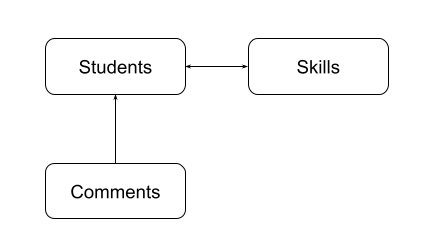

# Rest Assured Workshop

¡Bienvenido!

El objetivo de este taller es aprender sobre llamados rest con [RestAssured](https://rest-assured.io/). Durante el taller exploraremos la configuración de un proyecto desde cero (creará un repositorio con su cuenta), prepararlo para un proceso de integración continua por medio de Github actions y se abarcarán varios ejercicios prácticos, incluyendo temas como llamados HTTP, códigos de respuesta, reportes y mucho más.

Para el desarrollo del taller usaremos [GitHub](https://github.com/) y [GitHub Flow](https://docs.github.com/en/get-started/quickstart/github-flow) para realizar la entrega de cada ejercicio práctico.

Se asume que la persona tiene conocimientos previos en:

* Git (Puede seguir este [enlace](https://services.github.com/on-demand/downloads/es_ES/github-git-cheat-sheet/) con los comandos más utilizados en git)
* GitHub
* Conocimiento básico en JAVA (Clases, Objetos, POM)

#### Tips de GitHub Flow:

1. Para cada ejercicio crear una rama (Investiga: _gitflow naming conventions_ )
1. Crea un Pull Request (PR) por cada punto (Recuerda las interacciones como comentarios en inglés)
1. Después de que se recibe aprobación de cada punto por parte de los colaboradores (punto 1.17) se debe hacer merge de la rama, utilizando squash and merge.
1. Antes de empezar un nuevo punto se debe hacer pull de main para asegurarnos que tenemos los últimos cambios del anterior punto.

### Tabla de Contenido

1. [Configuración Inicial del Proyecto](#1-configuración-inicial-del-proyecto)
1. [Llamados a métodos HTTP](#2-llamados-a-métodos-http)
1. [Autenticación en RestAssured](#3-Autenticación-en-RestAssured)
1. [Aserciones con Hamcrest](#4-Aserciones-con-Hamcrest)
1. [Configuremos nuestro reporte con Allure](#5-Configuremos-nuestro-reporte-con-Allure)
1. [Ejercicio final usando una API real](#6-Ejercicio-final-usando-una-API-real)
1. [Configurar Integración Continua (CI)](#7-Configurar-Integración-Continua-(CI))

### 1. Configuración Inicial del Proyecto

**Descripción**: Se configurará inicialmente el proyecto con [Java](https://www.oracle.com/co/java/technologies/javase/javase8u211-later-archive-downloads.html) en el IDE [eclipse](https://www.eclipse.org/downloads/). Adicionalmente se creará la configuración necesaria básica para un repositorio de [Github](https://help.github.com/)

**Nota:** Si no tiene conocimiento sobre Github se le recomienda realizar las [Guias de Github](https://guides.github.com/activities/hello-world/) o el lab de [Introduction to Github](https://lab.github.com/githubtraining/introduction-to-github)

1. [Instalar JDK 8](https://www.oracle.com/co/java/technologies/javase/javase8u211-later-archive-downloads.html) en su equipo si no lo tiene instalado
1. [Instalar Eclipse](https://www.eclipse.org/downloads/) en su equipo si no lo tiene instalado (Eclipse IDE for Java Developers).
1. Configurar la variable de ambiente [JAVA_HOME](https://www.codejava.net/java-core/how-to-set-java-home-environment-variable-on-windows-10)
1. Instalar plugin de TestNG
    * Click en la pestaña de Help
    * Eclipse Marketplace
    * En la barra de búsqueda poner TestNG
    * Instalar la primera, TestNG for Eclipse. De click en Confirm y Finish
    * Marque todas las casillas y click en Trust Selected
    * Le pedirá que reinicie eclipse, acepte
1. Iniciar eclipse y crear un nuevo proyecto maven:
    * Archivo (File)
    * Nuevo (New)
    * Otro.. (Other..)
    * En el cuadro de búsqueda poner Maven y seleccionar **Maven Project**
    * Usar ubicación por defecto o seleccionar una. Siguiente
    * Buscar **maven-archetype-quickstart** del group id apache. Seleccionar y siguiente
    * En Group Id poner: com.restassured
    * En Artifact Id: workshop
    * Click en Finish
    * En la parte izquierda se generó el proyecto con nombre workshop. Se puede cambiar
1. Cambiar la librería para que ejecute con Java 8
    * Abrír el archivo **pom.xml** y cambiar donde esta `maven.compiler.source` y `maven.compiler.target` de `1.7` a `1.8`. Guardar y cerrar
    * Click derecho al proyecto > Maven > Update Project
    * Si al lado derecho de JRE System Library aparece JavaSE-1.8 todo esta funcionando correctamente

1. Crear una cuenta en Github si no la tiene.
1. Crear un repositorio en limpio dentro de la página de GitHub con el nombre de **rest-assured-workshop**
1. En el equipo, abrir la carpeta donde se creó el proyecto de Maven en eclipse y abrir una consola en esa ruta
1. Crear archivo .gitignore ```echo "" >> .gitignore```
1. Copiar, pegar y guardar el siguiente contenido. Esto evitará que se suban archivos al repositorio con estas extensiones:

    ```
    # Compiled class file
    *.class

    # Log file
    *.log

    # Package Files #
    *.jar
    *.war
    *.zip
    *.tar.gz
    *.rar

    # Auto-generated

    test-output/
    target/
    .idea/
    .vscode/

    pom.xml.tag
    pom.xml.releaseBackup
    pom.xml.versionsBackup
    pom.xml.next
    #Local Allure files
    .allure/
    allure-results/*.json
    ```

1. Seguir las instrucciones para realizar el primer commit

    ``` shell
    echo "# rest-assured-workshop" >> README.md
    git init
    git add .
    git commit -m "first commit"
    git branch -M main
    git remote add origin git@github.com:<su-usuario>/rest-assured-workshop.git
    git push -u origin main
    ```

1. Agregar dependencias de RestAssured y TestNG en el pom.xml

    * [RestAssured](https://mvnrepository.com/artifact/io.rest-assured/rest-assured) 
    * [TestNG](https://mvnrepository.com/artifact/org.testng/testng)
    * [Json-simple](https://mvnrepository.com/artifact/com.googlecode.json-simple/json-simple)

    Las dependencias deberían quedar similiar a:
    ```xml
    <dependency>
        <groupId>io.rest-assured</groupId>
        <artifactId>rest-assured</artifactId>
        <version>5.2.0</version>
        <scope>test</scope>
    </dependency>

    <dependency>
        <groupId>org.testng</groupId>
        <artifactId>testng</artifactId>
        <!--latest testng supported on java 8-->
        <version>7.5</version>
        <scope>test</scope>
    </dependency>

    <dependency>
        <groupId>com.googlecode.json-simple</groupId>
        <artifactId>json-simple</artifactId>
        <version>1.1.1</version>
    </dependency>
    ```

1. Crear carpeta de pruebas (de ahora en adelante `test`)
    * En la ruta `src/test/java/com/restassured` crear carpeta con de nombre `test`

1. Configurar Git para revision del workshop para cada punto

1. Proteger la rama `main` para que los pull request requieran revisión de otros desarrolladores y se compruebe el estado de nuestros test ("ok" :heavy_check_mark: o "fallaron" :x:) antes de hacer un merge a la rama.

    Ir a Settings > Branches adicionamos una regla dando click en **add rule**. Escribimos `main` en el campo de **branch name pattern**. Una vez hecho eso, damos click en las siguientes opciones:
    

1. Añadir como colaboradores (ir a settings del repositorio y en Collaborators) a:
   * [dianakrog](https://github.com/dianakrog)
   * [diegomtylop](https://github.com/diegomtylop)
   * [kliver98](https://github.com/kliver98)
   * [Scot3004](https://github.com/Scot3004)

### 2. Llamados a métodos HTTP

#### Creando peticiones GET y POST 
1. Crear la clase `GetAndPostExample.java` en la carpeta de `test`
    En caso que el archivo este vacío, copie y pegue:
    ```java
    package com.restassured.test;

    public class GetAndPostExample {
    }
    ```
1. Ahora vamos a crear nuestra prueba enviando una petición GET

    Copie y pegue:
    ```java
    @Test
    public void testGet() {
		RestAssured.baseURI = "https://reqres.in/api";
		
		when().
			get("/users?page=2").
		then().
			statusCode(200).
			body("data.size()", is(6)).
			body("data.first_name", hasItems("George", "Rachel"));
	};
    ```
    Primero definimos la baseURI que especifica la url base donde esta el servicio que consumiremos. Seguidamente preparamos el request, pero en este caso no tenemos ninguna precondición (given) entonces podemos ir a la acción (when) que define un método al API de tipo GET (get) para el endpoint que retorna los usuarios.
    Finalmente (then) validamos el status code de respuesta y datos del body de respuesta, como que contenga 6 elementos y especificamente contenga George y Rachel.

1. Vamos a crear la petición para el POST

    Copie y pegue:
    ```java
    @Test
	public void testPost() {
		
		JSONObject request = new JSONObject();
		
		request.put("name", "Ernesto Perez");
		request.put("job", "QA Automation");

		RestAssured.baseURI =  "https://reqres.in/api";
		
		given().
			header("Content-Type", "application/json").
			contentType(ContentType.JSON).
			body(request.toJSONString()).
		when().
			post("/users").
		then().
			statusCode(201).
			log().all();
	}
    ```
    Primero preparamos la request que enviaremos como un JSON, para esto usamos la clase JSONObject y después imprimimos como se vería ese JSON que creamos.
    Luego especificamos la url base (baseURI) a la cual le enviaremos el request.
    Finalmente en formato gherkin preparamos, enviamos y validamos el request. Aquí ponemos los encabezados necesarios y el cuerpo a enviar, luego la acción que sería la url base y adicionamos el resto del endpoint para el método POST, con el "then" verificamos el código de estado de la petición e imprimimos lo que nos retornó el endpoint.
    La parte importante aquí es la acción (when) para especificar el método HTTP.

    __Nota:__ Si quisieramos imprimir (por debuguear rápidamente por ejemplo) como esta el request formado, podemos usar `System.out.println(request.toJSONString());`

##### Ejercicio opcional:

 Usando usando esta API de Pokémon ([pokeapi.co]( https://pokeapi.co)), consumir el endpoint GET para obtener la información de un pokémon
 e imprimir el JSON de respuesta en la consola

#### Creando peticiones PUT, PATCH and DELETE
1. Crear la clase `PutPatchDeleteExample.java` en la carpeta de `test`. En caso que el archivo este vacío, copie y pegue:
    ```java
    package com.restassured.test;

    public class PutPatchDeleteExample {
    }
    ```
1. Ahora vamos a crear nuestras pruebas enviando una petición PUT y otra de PATCH

    Copie y pegue las siguientes porciones de código:
    ```java
    @Test
	public void testPut() {
		
		JSONObject request = new JSONObject();
		
		request.put("name", "Ernesto Perez");
		request.put("job", "QA Automation");
		
		RestAssured.baseURI =  "https://reqres.in/api";
		
		given().
			header("Content-Type", "application/json").
			contentType(ContentType.JSON).
			body(request.toJSONString()).
		when().
			put("/users/2").
		then().
			statusCode(200).
			log().all();
				
	}
    ```
    ```java
    @Test
	public void testPatch() {
		
		JSONObject request = new JSONObject();
		
		request.put("name", "Ernesto Perez");
		request.put("job", "QA Automation");
		
		RestAssured.baseURI =  "https://reqres.in";
		
		given().
			header("Content-Type", "application/json").
			contentType(ContentType.JSON).
			body(request.toJSONString()).
		when().
			patch("/api/users/2").
		then().
			statusCode(200).
			log().all();
				
	}
    ```
    Primero preparamos la request que enviaremos como un JSON, para esto usamos la clase JSONObject y después imprimimos como se veria ese json que creamos.
    Luego especificamos la url base (baseURI) a la cual le enviaremos el request.
    Finalmente en formato gherkin preparamos, enviamos y validamos el request. Aquí ponemos los encabezados necesarios y el body a enviar, luego la acción que se sería la url base y adicionamos el resto del endpoint para el método (put o patch), con el then verificamos el status code de la petición e imprimimos lo que nos retorno el endpoint.
    La parte importante aquí es la acción (when) para especificar el método HTTP.
1. Vamos a crear la petición para el DELETE

    Copie y pegue:
    ```java
    @Test
	public void testDelete() {
		
		RestAssured.baseURI =  "https://reqres.in";
		
		when().
			delete("/api/users/2").
		then().
			statusCode(204).
			log().all();
				
	}
    ```
    En este caso no es necesario definir precondiciones o preparar lo que enviaremos (Given), debido a que el método DELETE de este endpoint solo se le especifica en la url (eliminar el usuario con id 2). Finalmente validamos el status code e imprimimos la respuesta de la petición.


### 3. Autenticación en RestAssured

Muchos servicios requieren de autenticación para consumir sus métodos, en este ejercicio vamos a construir un ejemplo de autenticación básica (Basic Auth).

Para esto utilizaremos el recurso [basic-auth de postman]( https://postman-echo.com/basic-auth). El endpoint acepta un nombre de usuario y una contraseña predeterminados y devuelve un código de estado de 200 ok, solo si se proporciona el mismo correctamente. De lo contrario, devolverá un código de estado 401 no autorizado.

La información de autenticacion del servicio es:

**Username**: _postman_

**Password**: _password_

Empecemos

1. Cree una clase Java llamada `BaseClassAuth.java` en el paquete `com.restassured.test` y cree una petición para autenticación con el siguiente código, la cual contiene los parámetros de la petición y autenticación:

	Copie y pegue:
    ```java
	package com.restassured.test;
	import org.testng.annotations.BeforeClass;
	import io.restassured.RestAssured;
	
	public class BaseClassAuth {
		
		@BeforeClass
		public void setup() {
			
			RestAssured.authentication = RestAssured.preemptive().basic("postman", "password");
			
			RestAssured.baseURI = "https://postman-echo.com/basic-auth";
			
		}
	
	}
    ```

1. Ahora cree una clase Java llamada `RestAssuredAuthTest.java` en el paquete `com.restassured.test` que extienda de la clase `BaseClassAuth.java` y que hace la petición para la autenticación.

	Copie y pegue:
    ```java
    package com.restassured.test;

	import org.testng.annotations.Test;
	
	import io.restassured.RestAssured;
	
	public class RestAssureAuth extends BaseClassAuth{
		
		@Test
		public void test1() {
			
			int code = RestAssured.given().
					get().
					getStatusCode();
			
			System.out.println("Response code form server is " + code);
			
		}
	
	}
    ```
    
 1. Ahora verifiquemos que el método de autenticación quedó correcto. Desde la clase `RestAssuredAuthTest.java` ejecute la prueba y verifique que el código de respuesta que se imprime en consola es 200.
 
 ### 4. Aserciones con Hamcrest
 
 Vamos a realizar la verificación de una de nuestras pruebas. Para esto usaremos Hamcrest. Lo primero que debemos hacer es agregar la librería que nos permite hacer las aserciones.
 
 1. En el archivo pom.xml agregue la dependencia de `hamcrest-all` que se encuentra en el repositorio de maven.
 
	 Copie y pegue:
	 ```xml
	 <dependency>
	   <groupId>org.hamcrest</groupId>
	   <artifactId>hamcrest-all</artifactId>
	   <version>1.3</version>
	   <scope>test</scope>
	 </dependency>
	 ```
	    
 1. Para que los cambios sean tomados actualice las librerías. Desde Eclipse puede hacer clic derecho desde el proyecto, seleccione la opción Maven y luego Update Project. Verifique que este seleccionado el proyecto sobre el cual esta trabajando y luego ejecute OK.
 
 1. Ahora, importe los metodos de Hamcrest agregando la siguiente linea: 
 
 	Copie y pegue:
	```java
	import static org.hamcrest.Matchers.*;
	```
	    
 1. Ahora actualice el metodo "test1" de la clase `RestAssuredAuthTest.java` para que quede de la siguiente forma.

	Copie y pegue:
	```java
	public void test1() {
		
	RestAssured.given()
		.get()
		.then()
		.statusCode(200)
		.body("authenticated", equalTo(true));
		
	}
	```
	  
	Note que se agregó `then()` indicando que siguen las aserciones y posteriormente los matchers statusCode para validar que se entregue un código de respuesta válida y el matcher body para verificar que sea el esperado.

 1. Ahora ejecutemos la prueba: Para esto, ejecute la clase `RestAssuredAuthTest.java` y verifique que el test quedó OK.
 
 1. Haga fallar la aserción: en el `statusCode(200)`, cambíelo por 300 y ejecute nuevamente. Verá que ahora la prueba queda fallida.
 
 Puede ver más Matchers [aquí]( https://www.javadoc.io/doc/org.hamcrest/hamcrest/2.1/org/hamcrest/Matchers.html).
 
 
### 5. Configuremos nuestro reporte con Allure
  
 1. En el archivo `pom.xml` agregue la dependencia de Allure que se encuentra en el repositorio de maven.
 
	 Copie y pegue:
	 ```xml
	 <dependency>
         <groupId>io.qameta.allure</groupId>
         <artifactId>allure-testng</artifactId>
         <version>2.19.0</version>
         <scope>test</scope>
     </dependency>
	 ```
	
 1. En el archivo `pom.xml` agregue en la sección `properties` la siguiente línea
 
	 Copie y pegue:
	 ```java
	 <aspectj.version>1.9.7</aspectj.version>
	 ```
	    
 1. En el archivo `pom.xml` agrega los siguientes plugins que le permitiran generar el reporte. Recuerde que los plugins deben ir en la sección `<build><plugins>` del XML 
 
	 Copie y pegue:
	 ```xml
	 <plugin>
        <groupId>org.apache.maven.plugins</groupId>
        <artifactId>maven-surefire-plugin</artifactId>
        <version>3.0.0-M7</version>
        <configuration>
            <!--Ruta de las clases de prueba-->
            <includes>
                <include>com/restassured/test/**.java</include>
            </includes>
            <argLine>
                -javaagent:"${settings.localRepository}/org/aspectj/aspectjweaver/${aspectj.version}/aspectjweaver-${aspectj.version}.jar"
            </argLine>
        </configuration>
        <dependencies>
            <dependency>
                <groupId>org.aspectj</groupId>
                <artifactId>aspectjweaver</artifactId>
                <version>${aspectj.version}</version>
            </dependency>
        </dependencies>
    </plugin>
    
    <!-- Plugin para generar el reporte de allure mediante el comando mvn allure:serve-->
    <plugin>
        <groupId>io.qameta.allure</groupId>
        <artifactId>allure-maven</artifactId>
        <version>2.11.2</version>
        <configuration>
            <reportVersion>2.13.9</reportVersion>
            <resultsDirectory> ${basedir}/allure-results</resultsDirectory>
        </configuration>
    </plugin>
	 ```
	 
 1. Para que los cambios sean tomados actualice las librerías. Desde Eclipse puede hacer clic derecho desde el proyecto, seleccione la opción Maven y luego Update Project. Verifique que esté seleccionado el proyecto sobre el cual esta trabajando y luego ejecute OK.
 
 1. Ahora actualice el método `test1` de la clase `RestAssuredAuthTest.java` para que quede de la siguiente forma.
 
 	Copie y pegue:
	```java
	@Test(priority = 0, description="Valid Autentication Scenario with valid username and password.")
	@Severity(SeverityLevel.BLOCKER)
	@Description("Test Description: Login test with valid username and password.")
	@Story("Get autentication token")
	@Step("Petition get to autentication")
	public void test1() {
			
		RestAssured.given()
			.get()
			.then()
			.statusCode(200)
			.body("authenticated", equalTo(true));
			
	}
	```
 	
 	__Nota:__ Estas anotaciones son necesarias, ya que serán mostradas en el reporte de Allure y nos permitirá tener detalles de la prueba en el reporte. Existen otros tipos de anotaciones que le ayudarán a mejorar su reporte según lo necesite.
 
 1. Finalmente, abra una consola de comandos desde dentro de su carpeta del proyecto `rest-assured-workshop` y ejecute los siguientes comandos:  
 		
    ```shell
       mvn clean test
       mvn allure:serve
    ```
 	Esto le abrirá el reporte en el navegador, navegue el reporte y encuentre las anotaciones puestas en la clase de prueba.
 	
 	__Nota:__ Lea más acerca de Allure [aquí](https://docs.qameta.io/allure#_testng).

### 6. Ejercicio final usando una API real

Para este punto usaremos una API real que simula el funcionamiento de una aplicación académica donde se puede hacer gestión de estudiantes
y sus habilidades, así como darles retroalimentación por medio de comentarios.

#### Documentación de la API 📚 
La documentación de la API, así como ejemplos de las peticiones están disponibles en 
[este enlace](https://documenter.getpostman.com/view/8538830/2s8YzUyMcb)

#### Diagrama de Entidades



Estas son las principales funcionalidades que brinda la API

1. Crear una cuenta / autenticarse.
2. Añadir y gestionar estudiantes.
3. Asociar habilidades a los estudiantes.
4. Ingresar comentarios para los estudiantes.

### Acceso a la API
Para poder hacer invocaciones a la API es necesario incluir los siguientes encabezados
en todas las peticiones HTTP, por favor solicita los valores válidos a los encargados del ramp-up.

```
X-Parse-Application-Id: <application_id> 
X-Parse-REST-API-Key: <api_key>
```
**Nota:** Estos datos no se deben "quemar" en el código fuente del ejercicio que vayas a entregar, puesto que es información sensible que no debe ser subida a los repositorios, 
se recomienda variables de entorno, parámetros de java u otro mecanismo similar.


#### Acceso a los endpoints que no requieren autenticación.

Algunos de los endpoints de la API no requieren autenticación para ser invocados, por ejemplo el endpoint de habilidades ("Skills") se puede invocar de la siguiente manera:

```shell
curl -X 'GET' \
  'https://parseapi.back4app.com/classes/Skills' \
  -H 'accept: application/json' \
  -H 'X-Parse-Application-Id: <application_id>' \
  -H 'X-Parse-REST-API-Key: <api_key>'
```
Nota que en el encabezado únicamente se deben especificar los datos del _application id_ y el _REST API key_ pero no es necesario indicar ningún tipo de tóken asociado a un usuario en particular.

_Respuesta de ejemplo_
```json
{
  "results": [
    {
      "name": "Functional testing",
      "description": "Is a type of software testing that validates the software system against the functional requirements/specifications",
      "objectId": "ODp5lTet6R"
    },
    {
      "name": "Cypress",
      "description": "Automation framework used to automate UI and component testing",
      "objectId": "Z3NyhPqOQT"
    }
  ]
}
```

#### Acceso a los endpoints que requieren autenticación.

Con el fin de aislar los datos de prueba entre las personas que hacen el ramp-up, la API permite
la creación de una cuenta de usuario para así filtrar la información y mostrarle a cada usuario únicamente
aquellos registros creados por el mismo.

Para poder acceder a los endpoints que requieren autenticación,
es necesario obtener un **tóken de sesión** y enviarlo en el encabezado en cada
petición junto con los ya mencionados **application id** y **REST API token**, a continuación se listan los pasos necesario para obtener dicho tóken.

1. #### Crear una cuenta ( endpoint _POST_ `/users` )

**Notas:**  
   * Los datos ingresados acá no tienen que corresponder a un correo
   real, pero los debes recordar porque serán requeridos para obtener el tóken de autenticación
   * Dado que la creación de la cuenta se debe hacer una única vez y no debe estar incluída en el código fuente del ejercicio a entregar, se recomienda usar una herramienta como postman para este paso.
    
   ```shell
   # No olvides especificar los datos de la nueva cuenta
   curl -X POST \
      -H "X-Parse-Application-Id: <APPLICATION_ID>" \
      -H "X-Parse-REST-API-Key: <API_KEY>" \
      -H "Content-Type: application/json" \
      -d "{ \"password\":\"<CONTRASEÑA>\", \"username\": \"<NOMBRE_USUARIO>\",\"email\": \"<CORREO_ELECTRONICO>\" }" \
      https://parseapi.back4app.com/users
   ```
   _Respuesta ejemplo:_

   ```json
  {
      "objectId": "<user_id>",
      "createdAt": "2022-12-12T20:06:15.953Z",
      "sessionToken": "<session_token>"
   }
   ```

2. #### Autenticarse en la API (Endpoint `/login` )
    **Nota:** 
   * La lógica para invocar este endpoint debe ser incluída en el código fuente del ejercicio a entregar, puesto que el tóken debe ser obtenido cada vez que se vayan a ejecutar los scripts. 
   
   Una vez creada la cuenta, puedes usar las credenciales definidas para autenticarte de la siguiente manera:

    ```shell
   # Presta atención a los parametros NOMBRE_DE_USUARIO Y CONTRASEÑA
    curl -X GET \
       -H "X-Parse-Application-Id: <application_id>" \
       -H "X-Parse-REST-API-Key: <api_key>" \
       -H "X-Parse-Revocable-Session: 1" \
       -G \
       --data-urlencode 'username=<NOMBRE_DE_USUARIO>' \
       --data-urlencode 'password=<CONTRASEÑA>' \
       https://parseapi.back4app.com/login
   ```
   _Respuesta de ejemplo_
   ```json
   {
    "objectId": "WoHkPt0sxP",
    "username": "academy_student5",
    "email": "academy_student5@mailinator.com",
    "createdAt": "2022-12-12T20:06:15.953Z",
    "updatedAt": "2022-12-12T20:06:15.953Z",
    "ACL": {
        "*": {
            "read": true
        },
        "WoHkPt0sxP": {
            "read": true,
            "write": true
        }
    },
    "sessionToken": "r:1bd01746f758eaf2f1c43e2e452f25bf"
   }
   ```
   
   El valor retornado en el campo `sessionToken` se debe enviar en el encabezado de las peticiones que requieran autenticación de la siguiente forma:
    
   `X-Parse-Session-Token: <SESSION_TOKEN>`
 
   A continuación un ejemplo de como invocar el endpoint de estudiantes (Students) que requiere el **tóken de sesión**.
    
   ```shell
   curl --location --request GET 'https://parseapi.back4app.com/classes/Students' \
      --header 'X-Parse-Application-Id: <APPLICATION_ID>' \
      --header 'X-Parse-REST-API-Key: <API_KEY>' \
      --header 'X-Parse-Session-Token: <SESSION_TOKEN>'
   ```

### Ejercicio a desarrollar

A continuación se listan varios escenario de prueba para la API mencionada usando sintaxis *gherkin*, 
para cada uno de los "features" debes crear una clase _Test_ e implementar 
un método por cada uno de los escenarios que haga las validaciones enunciadas haciendo uso de RestAssured
y los conceptos vistos durante el workshop

#### Escenarios para el endpoint de habilidades (no requiere autenticación)

```gherkin
Feature: Gestionar las habilidades disponibles en el sistema
 
    Scenario: Listar todas las habilidades disponibles en el sistema 
        Given el servicio de gestión de habilidades "Skills"  
        When se hace una petición GET al endpoint /classes/Skills  
        Then el servicio responde un código 200 
        And en el cuerpo de la respuesta la longitud de la propiedad "results" es mayor a 0 
    
    Scenario: Consultar una habilidad por código 
        Given el servicio de gestión de habilidades "Skills"  
        When se hace una petición GET al endpoint /classes/Skills/{skillId} especificando el id de una habilidad existente 
        Then el servicio responde un código 200 
        And en el cuerpo de la respuesta se presenta la información de la habilidad que debe incluir los campos "name", "description" y "objectId"  
    
    Scenario: Verificar que no se permite eliminar habilidades 
        Given el servicio de gestión de habilidades "Skills"  
        When se hace una petición DELETE al endpoint /classes/Skills/{skillId} especificando el id de una habilidad existente 
        Then el servicio retorna un error HTTP 400 
        And el cuerpo de la respuesta debe incluir el campo "error" con un mensaje diciendo que el usuario no está autorizado para realizar esta acción
        
    Scenario: Verificar que para poder consultar las habilidades se deben especificar los encabezados válidos 
        Given el servicio de gestión estudiantes "Skills"
        And NO se especifican los encabezados "X-Parse-REST-API-Key" y "X-Parse-Application-Id" 
        When se hace una petición GET al endpoint /classes/Skills 
        Then el servicio responde un código HTTP 401 
        And el cuerpo de la respuesta debe incluir el campo "error" con un mensaje diciendo "unauthorized" 
```

#### Escenarios para el endpoint de gestión de estudiantes (requiere autenticación)

```gherkin
Feature: Gestionar los estudiantes de la aplicación 

    Scenario: verificar que se pueda crear un estudiante y este quede disponible para consultar 
        Given el servicio de gestión de estudiantes "Students" con autenticación válida 
        When se hace una petición POST al endpoint /classes/Students con información valida de un estudiante no existente 
        Then el servicio responde con código 201 
        And el cuerpo de la respuesta debe incluir el campo "objectId" y "createdAt" 
        When se consultan los usuarios haciendo una petición GET al endpoint /classes/Students
        Then La respuesta del servicio presenta una lista de estudiantes existentes que debe incluir el estudiante recién creado
        
     Scenario: verificar que no se puedan crear estudiantes con el mismo nombre y apellido 
        Given el servicio de gestión de estudiantes "Students" con autenticación válida 
        When se hace una petición POST al endpoint /classes/Students con información valida de un estudiante existente 
        Then el servicio responde un código HTTP 400 
        And el cuerpo de la respuesta debe mostrar un mensaje diciendo que hay duplicidad de información
        
    Scenario: verificar que no se pueden ingresar caracteres especiales en el nombre 
        Given el servicio de gestión de estudiantes "Students" con autenticación válida 
        When se hace una petición POST al endpoint /classes/Students enviando caracteres especiales en el campo "name" 
        Then el servicio responde un código HTTP 400 
        And el cuerpo de la respuesta debe mostrar un mensaje diciendo que se encontraron caracteres inválidos en el campo "name"   
    
    Scenario: verificar que los estudiantes puedan ser actualizados 
        Given el servicio de gestión de estudiantes "Students" con autenticación válida 
        When se hace una petición PUT al endpoint /classes/Students/{studentId} para un estudiante existente 
        And se envía una nueva lista de intereses en el parámetro "interests" en el payload del request 
        Then el servicio responde con código HTTP 200
        And el cuerpo de la respuesta debe incluir el campo "updatedAt" 
        
    Scenario: Verificar que para poder crear nuevos estudiantes se deba estar autenticado en el sistema 
        Given el servicio de gestión estudiantes "Students" 
        And se especifican los encabezados "X-Parse-REST-API-Key" y "X-Parse-Application-Id" con valores válidos
        And NO se especifica el encabezado "X-Parse-Session-Token"
        When se hace una petición POST al endpoint /classes/Students con información valida de un estudiante no existente
        Then el servicio responde un código HTTP 404 
        And el cuerpo de la respuesta se debe mostrar un mensaje diciendo que el usuario debe estar autenticado
```


#### Escenarios para el endpoint de gestión de habilidades de un estudiante (StudentSkills) (requiere autenticación)

```gherkin
Feature: Gestionar los habilidades de los estudiantes 

    Scenario: Verificar la adición de una habilidad a un estudiante 
        Given el servicio de gestión de habilidades "StudentsSkills" con autenticación válida 
        When se hace una petición POST al endpoint /classes/StudentSkills especificando información de un estudiante y una habilidad existente 
        Then el servicio responde un código HTTP 201 
        And el cuerpo de la respuesta debe tener los campos "objectId" y "createdAt"
        When cuando se hace una petición GET al endpoint /classes/Students/{studentId} para el mismo estudiante
        Then el cuerpo de la respuesta debe incluir el campo "skillNames"
        
    Scenario: Verificar la adición de una habilidad repetida a un estudiante 
        Given el servicio de gestión de habilidades "StudentsSkills" con autenticación válida 
        When se hace una petición POST al endpoint /classes/StudentSkills especificando información de un estudiante y una habilidad ya asociada al estudiante 
        Then el servicio responde un código HTTP 400 
        And el cuerpo de la respuesta debe incluir un mensaje de error diciendo que hay unformación duplicada
    
    Scenario: Verificar que para poder asociar nuevas habilidades se deba estar autenticado en el sistema 
        Given el servicio de gestión de habilidades de un estudiante "StudentsSkills" 
        And se especifican los encabezados "X-Parse-REST-API-Key" y "X-Parse-Application-Id" con valores válidos
        And NO se especifica el encabezado "X-Parse-Session-Token" 
        When se hace una petición POST al endpoint /classes/StudentSkills especificando información de un estudiante y una habilidad existente
        Then el servicio responde un código HTTP 404 
        And el cuerpo de la respuesta se debe mostrar un mensaje diciendo que el usuario debe estar autenticado
```

#### Escenarios para el endpoint de gestión de comentarios de un estudiante (Comments) (requiere autenticación)

```gherkin
Feature: Gestionar los comentarios a los estudiantes 
 
    Scenario: Verificar que se puedan agregar comentarios a los estudiantes 
        Given el servicio de gestión de comentarios "Comments" con autenticación válida 
        When hace una petición POST al endpoint /classes/Comments con información de un estudiante existente 
        Then el servicio responde con código HTTP 201
        And el cuerpo de la respuesta debe tener los campos "objectId", "comment" y "createdAt"
        When se consultan todos los comentarios haciendo una petición GET al endpoint /classes/Comments
        Then la respuesta del servicio presenta una lista de comentarios que debe incluir el comentario recién añadido
        
    Scenario: Verificar que se puedan borrar comentarios 
        Given el servicio de gestión de comentarios "Comments" con autenticación válida 
        When hace una petición DELETE al endpoint /classes/Comments/{commentId} con un ID de comentario existente 
        Then el servicio responde con código HTTP 200
        When se consultan los comentarios haciendo una petición GET al endpoint /classes/Comments
        Then la respuesta del servicio presenta una lista de los comentarios existentes que NO debe incluir el comentario recién eliminado
        
    Scenario: Verificar que los comentarios queden asociados al estudiante 
        Given el servicio de gestión de comentarios "Comments" con autenticación válida 
        When se hace una petición POST al endpoint /classes/Comments con información de un estudiante existente 
        Then el servicio responde con código HTTP 201
        When se hace una petición GET al endpoint /classes/Students/{studentId} para el mismo estudiante
        Then el cuerpo de la respuesta debe incluir el campo "comments" que debe incluir el comentario recién añadido   
```

### 7. Configurar Integración Continua (CI)

Antes de empezar con esta actividad asegurate de que los scripts estén corriendo correctamente en tu máquina local.

Para iniciar esta actividad, crea una nueva rama de tu proyecto.

Para crear la configuración del workflow de GitHub actions, vamos a crear un archivo `maven.yml` en el directorio `.github/workflows` que realice los siguientes pasos cuando creamos o actualizamos un Pull Request:
* Configuración de java
* Construye el proyecto con Maven

    1. Para esto puedes usar la plantilla que genera gitHub Actions
    * Ingresa a tu repositorio git desde la web 
    * Seleccione la pestaña Actions

    
* Acciona New workflow
* Acciona Configurar
* Selecciona la opción Maven Java Option, te presentara un nuevo archivo .yaml con una configuración estándar.

* Puedes copiar el texto informado como obligatorio (el siguiente), y lo pegas en el archivo `maven.yml` creado:
```yaml
name: Java CI with Maven

on:
  push:
    branches: [ "main" ]
  pull_request:
    branches: [ "main" ]

jobs:
  build:

    runs-on: ubuntu-latest

    steps:
      - uses: actions/checkout@v3
      - name: Set up JDK 11
        uses: actions/setup-java@v3
        with:
          java-version: '11'
          distribution: 'temurin'
          cache: maven
      - name: Build with Maven
        run: mvn -B package --file pom.xml
      - name: run tests
        run: mvn test
```

2. Con esta configuración, podrá ejecutar los tests del proyecto mediante consola con el comando `mvn test`. Agrega este comando al final del archivo `maven.yml` creado.
Copie y pegue:
```xml
    - name: run tests
      run: mvn test
```

En este punto, ya tenemos configurado nuestro workflow de CI. Puedes subir los cambios, y crea un Pull Request. Si accedes a este, veras el workflow ejecutando.


Si el Build se ejecuta correctamente, solicita aprobación.

